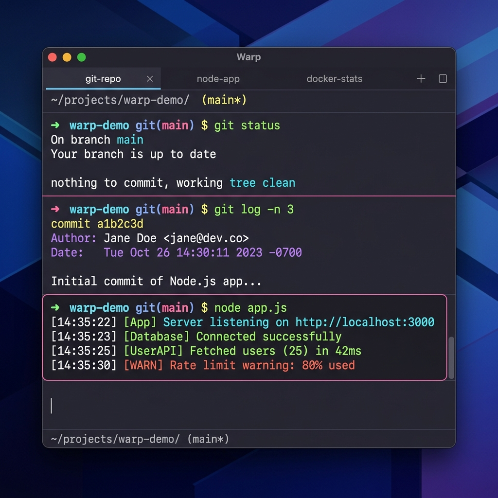
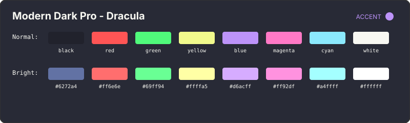
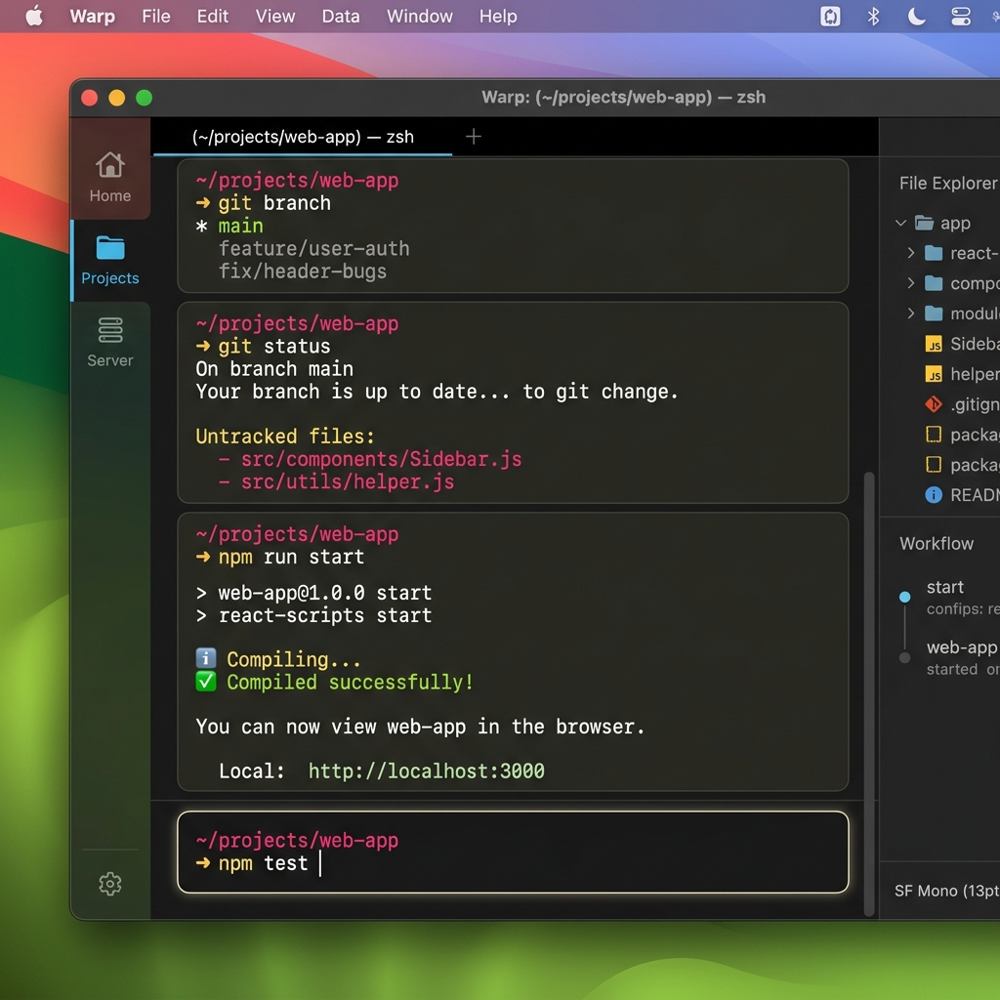
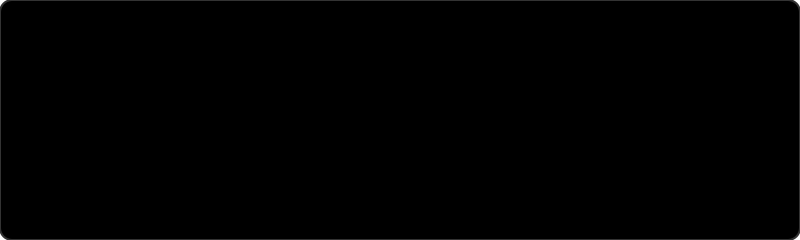
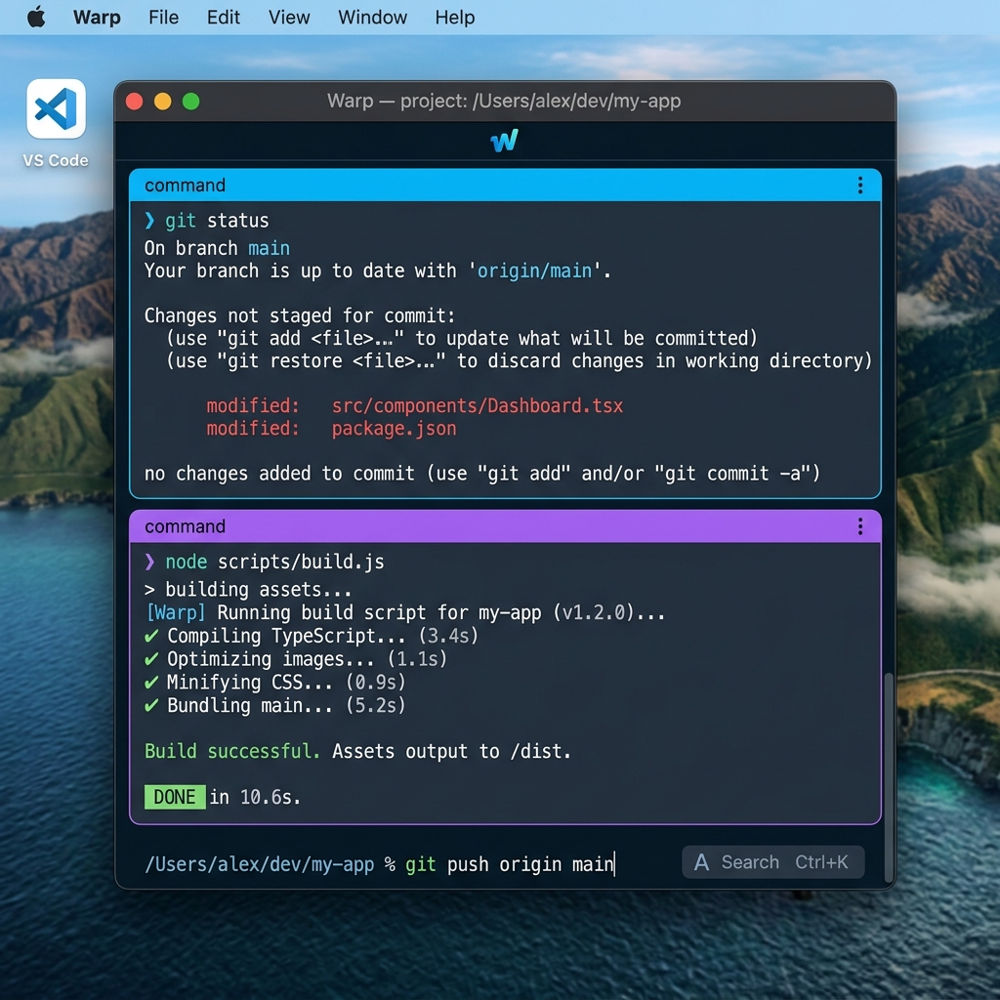
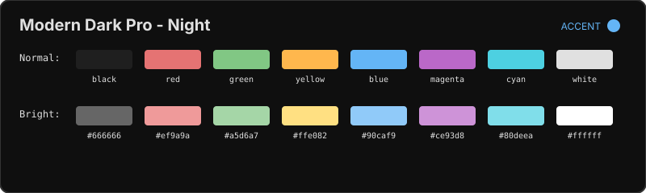

# 🎨 Modern Dark Pro - Warp Terminal Theme

[](LICENSE)
[](https://www.warp.dev/)
[](Formula/modern-dark-pro-warp.rb)

A premium, modern, and dark-mode-optimized Warp Terminal theme inspired by the [Modern Dark Pro](https://github.com/dvigo/modern-dark-pro) color palettes. 

Designed for developers who appreciate elegant contrast, clean typography, and low eye strain during long coding sessions.

---

## ✨ Features

- **🚀 Multiple Variant Support**: Choose between:
  - **Night** (subtle pastel tones, OLED-ready soft black background)
  - **Night Glass** (features an elegant dark mesh background image)
  - **Monokai** (classic vibrant Monokai accents, warm dark background)
  - **Dracula** (vibrant purple-centered classic dark aesthetic)
- **🎨 High-Contrast & Accessible**: Tuned ANSI color mappings for excellent syntax highlighting legibility in terminal logs, CLI utilities, and prompts.

---

## 🎨 Color Palettes & Variants

<!-- START THEMES -->

### 1. Modern Dark Pro - Dracula
- **Background**: `#282a36` | **Foreground**: `#f8f8f2` | **Accent**: `#bd93f9`

<div align="center">
  
  <br/><br/>
  
</div>

### 2. Modern Dark Pro - Monokai
- **Background**: `#272822` | **Foreground**: `#f8f8f2` | **Accent**: `#ae81ff`

<div align="center">
  
  <br/><br/>
  
</div>

### 3. Modern Dark Pro - Night
- **Background**: `#0f0f0f` | **Foreground**: `#e0e0e0` | **Accent**: `#64b5f6`

<div align="center">
  
  <br/><br/>
  
</div>

### 4. Modern Dark Pro - Night Glass
- **Background**: `#0f0f0f` | **Foreground**: `#e0e0e0` | **Accent**: `#64b5f6`

<div align="center">
  
</div>
<!-- END THEMES -->

---

## 📦 Installation

### Option 1: Quick Install (Recommended)
Run the automated installer script directly in your terminal:
```bash
curl -fsSL https://raw.githubusercontent.com/dvigo/modern-dark-pro-warp/main/install.sh | bash
```

### Option 2: Homebrew (macOS)
You can easily install the themes using Homebrew:
```bash
brew tap dvigo/modern-dark-pro-warp https://github.com/dvigo/modern-dark-pro-warp
brew install modern-dark-pro-warp
```
*Note: Homebrew will place the themes in the Homebrew prefix. To finish installation to Warp's local folder, follow the caveats printed after installation.*

### Option 3: Manual Installation

#### Step 1: Clone the repository
Clone this project into a local folder:
```bash
git clone https://github.com/dvigo/modern-dark-pro-warp.git ~/dev/modern-dark-pro-warp
```

#### Step 2: Run the installer
Run the provided installer script, which copies the theme configuration files to Warp's local custom themes folder (`~/.warp/themes/`):
```bash
cd ~/dev/modern-dark-pro-warp
./install.sh
```

To **uninstall**, you can run:
```bash
./install.sh --uninstall
```

---

## 🚀 How to Apply the Theme

1. Open **Warp Terminal**.
2. Press `Cmd + ,` to open **Settings**.
3. Select **Appearance** from the sidebar.
4. Under the **Themes** section, scroll down to the **Custom** category.
5. Choose your preferred variant:
   - `Modern Dark Pro - Night`
   - `Modern Dark Pro - Monokai`
   - `Modern Dark Pro - Dracula`

---

## 📄 License

This project is licensed under the MIT License - see the [LICENSE](LICENSE) file for details.
